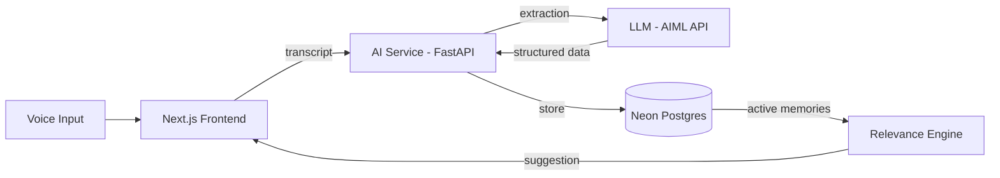

<div align="center">

# EchoMind


</div>

EchoMind listens to natural speech, extracts what matters — people, tasks, deadlines, events — and stores it in a living memory graph. Later, when it's relevant again, EchoMind proactively reminds you before you forget.

No manual note-taking. Just talk, and let EchoMind remember.

**Live demo:** [echomind.fastapicloud.dev/docs](https://echomind.fastapicloud.dev/docs)

---

## Features

- **Smart extraction** — LLM-powered pipeline pulls people, tasks, events, and relationships out of raw speech, with anti-hallucination checks and automatic retry on malformed output.
- **Memory graph** — every entity and relationship is stored in Postgres (Neon), deduplicated and updatable in real time.
- **Proactive suggestions** — a relevance-scoring engine watches your memories and surfaces the right one at the right time, phrased naturally by an LLM.
- **Voice-first** — built around AssemblyAI's real-time voice agent.

## Architecture



## Tech Stack

| Layer | Technology |
|---|---|
| Frontend | Next.js, TypeScript, Tailwind CSS |
| Voice | AssemblyAI |
| AI Service | FastAPI, Python, AIML API (GPT-4o-mini) |
| Database | Neon (Postgres) |
| Deployment | FastAPI Cloud |

## Team

| Member | Focus |
|---|---|
| Eman | AI/LLM extraction service, memory graph, proactive relevance engine |
| Aroon Zafar | Voice agent integration (AssemblyAI) |
| Felixdev205 | Voice-first frontend |
| Rabeesa | Memory repository, Neon Postgres foundation |

## Getting Started

### AI service
```bash
cd backend/services/ai
python -m venv venv && source venv/bin/activate   # Windows: venv\Scripts\activate
pip install -r requirements.txt
cp .env.example .env   # fill in DATABASE_URL and AIML_API_KEY
python main.py
```
Runs at `http://localhost:8001` — docs at `http://localhost:8001/docs`.

### Frontend
```bash
cd frontend
npm install
npm run dev
```
Open `http://localhost:3000`.

## API Reference

| Method | Endpoint | Description |
|---|---|---|
| POST | `/api/extract-memory` | Extract structured memory from a transcript (no save) |
| POST | `/api/remember` | Extract and persist to the memory graph |
| GET | `/api/memories` | Retrieve the full memory graph |
| POST | `/api/check-relevance` | Run the proactive relevance engine |
| POST | `/api/suggestions/confirm` | Accept a suggestion |
| POST | `/api/suggestions/dismiss` | Dismiss a suggestion |
| POST | `/api/forget` | Soft-delete a memory |
| POST | `/api/complete` | Mark a task/event completed |
| GET | `/api/health` | Health check |

## Project Structure

```
EchoMind/
├── backend/
│   └── services/
│       └── ai/            # FastAPI extraction & memory-graph service
│           ├── app/
│           ├── prompts/   # Versioned LLM prompts
│           └── main.py
├── frontend/               # Next.js voice-first UI
└── README.md
```

---

Built for the Global Open-Source AI Challenge Hackathon.
