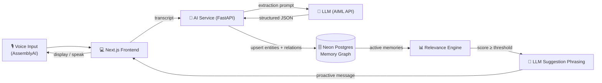

<div align="center">


<br/>


<br/><br/>


<br/><br/>

**[🚀 Live API Docs](https://echomind.fastapicloud.dev/docs)** &nbsp;•&nbsp;
**[📂 Repo](https://github.com/AroonZafar/EchoMind)** &nbsp;•&nbsp;
**[🐛 Report an Issue](https://github.com/AroonZafar/EchoMind/issues)**

</div>

<br/>

## 📖 About

**EchoMind** listens to natural speech, quietly figures out what actually matters — a person, a task, a deadline, an event — and stores it in a living **Personal Memory Graph**. Later, when the moment is relevant again, EchoMind proactively speaks up: *"Hey, you still have that thesis draft due today — want a reminder?"*

No manual note-taking. No forms. Just talk, and let EchoMind remember.

<br/>

## ✨ Key Features

<table>
<tr>
<td width="33%" valign="top">

### 🧠 Smart Extraction
LLM-powered pipeline pulls people, tasks, events, and relationships straight out of raw speech — with anti-hallucination checks and automatic retry on malformed output.

</td>
<td width="33%" valign="top">

### 🕸️ Living Memory Graph
Every entity and relationship is stored in a real graph (Postgres/Neon) — deduplicated, updatable, and queryable in real time.

</td>
<td width="33%" valign="top">

### 🔔 Proactive Suggestions
A relevance-scoring engine watches your memories and surfaces the right one at the right time, phrased naturally by an LLM.

</td>
</tr>
<tr>
<td width="33%" valign="top">

### 🎙️ Voice-First
Built around AssemblyAI's real-time voice agent — speak, and EchoMind is already listening and extracting.

</td>
<td width="33%" valign="top">

### 🛡️ Fail-Safe by Design
Two-stage retry on extraction, graceful LLM-timeout fallbacks, and cooldown-aware suggestion logic so nothing ever silently breaks.

</td>
<td width="33%" valign="top">

### 🚀 Deployed & Live
Running on FastAPI Cloud with a Neon Postgres backend — try the API right now via Swagger.

</td>
</tr>
</table>

<br/>

## 🏗️ Architecture



<br/>

## 🧰 Tech Stack

| Layer | Technology |
|---|---|
| **Frontend** | Next.js 16, TypeScript, Tailwind CSS, `react-force-graph-2d` |
| **Voice** | AssemblyAI real-time voice agent |
| **AI Service** | FastAPI, Python, httpx, AIML API (GPT-4o-mini) |
| **Database** | Neon (serverless Postgres) |
| **Deployment** | FastAPI Cloud |

<br/>

## 👥 Team

| Member | Focus Area |
|---|---|
| **Eman** ([@Eman2123](https://github.com/Eman2123)) | AI/LLM extraction service, memory graph logic, proactive relevance engine |
| **Aroon Zafar** ([@AroonZafar](https://github.com/AroonZafar)) | Voice agent integration (AssemblyAI) |
| **Felixdev205** | Voice-first frontend |
| **Rabeesa** | Memory repository, Neon Postgres foundation |

<br/>

## ⚡ Getting Started

### Prerequisites
- Node.js 18+
- Python 3.10+
- A Neon Postgres database
- An AIML API key

### 1️⃣ Clone the repo
```bash
git clone https://github.com/AroonZafar/EchoMind.git
cd EchoMind
```

### 2️⃣ Run the AI service
```bash
cd backend/services/ai
python -m venv venv && source venv/bin/activate   # Windows: venv\Scripts\activate
pip install -r requirements.txt
cp .env.example .env   # fill in DATABASE_URL and AIML_API_KEY
python main.py
```
Service runs at `http://localhost:8001` — interactive docs at `http://localhost:8001/docs`.

### 3️⃣ Run the frontend
```bash
cd frontend
npm install
npm run dev
```
Open `http://localhost:3000`.

<br/>

## 📡 API Reference (AI Service)

| Method | Endpoint | Description |
|---|---|---|
| `POST` | `/api/extract-memory` | Extract structured memory from a transcript (no save) |
| `POST` | `/api/remember` | Extract **and** persist to the memory graph |
| `GET` | `/api/memories` | Retrieve the full memory graph |
| `POST` | `/api/check-relevance` | Run the proactive relevance engine |
| `POST` | `/api/suggestions/confirm` | Accept a suggestion |
| `POST` | `/api/suggestions/dismiss` | Dismiss a suggestion |
| `POST` | `/api/forget` | Soft-delete a memory |
| `POST` | `/api/complete` | Mark a task/event completed |
| `GET` | `/api/health` | Health check |

Full interactive docs: **[echomind.fastapicloud.dev/docs](https://echomind.fastapicloud.dev/docs)**

<br/>

## 📂 Project Structure

```
EchoMind/
├── backend/
│   └── services/
│       └── ai/                # FastAPI extraction & memory-graph service
│           ├── app/
│           ├── prompts/       # Versioned LLM prompts
│           └── main.py
├── frontend/                  # Next.js voice-first UI
└── README.md
```

<br/>

<div align="center">

### 🤝 Contributing
Pull requests are welcome! Open an issue first for major changes.

<br/>


**Built with 💜 for the Global Open-Source AI Challenge Hackathon**

</div>
