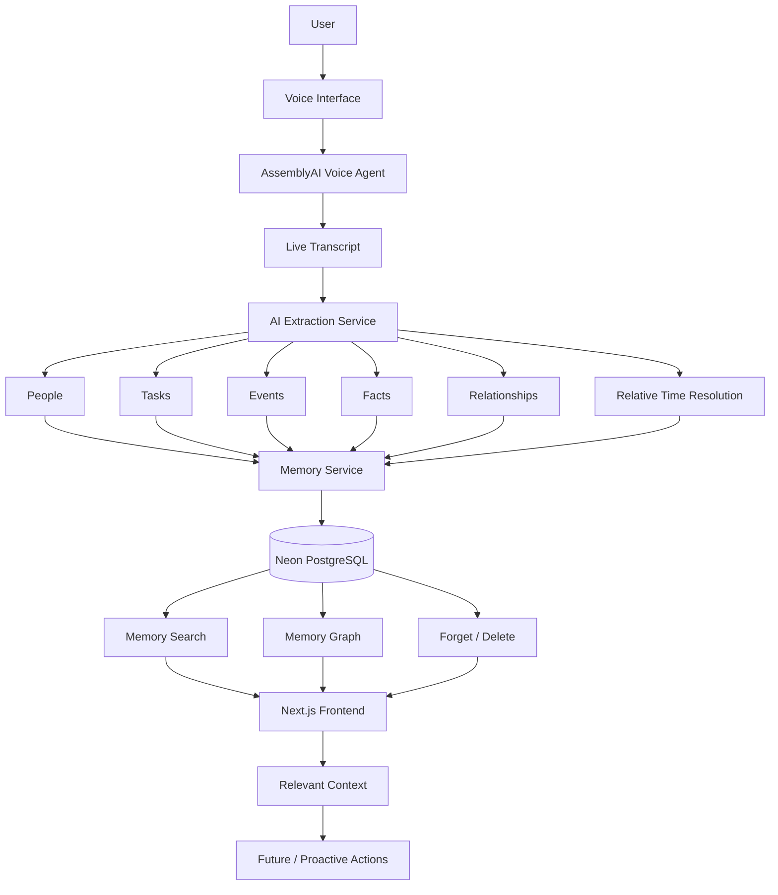
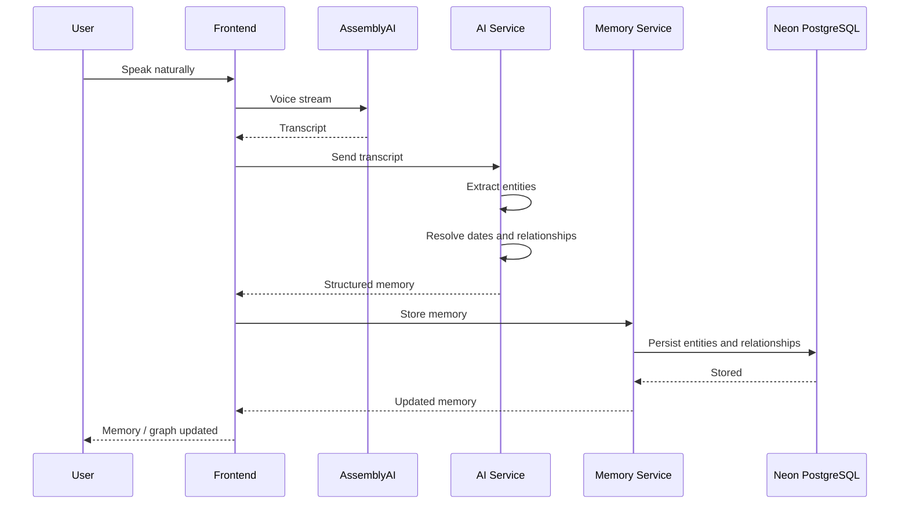
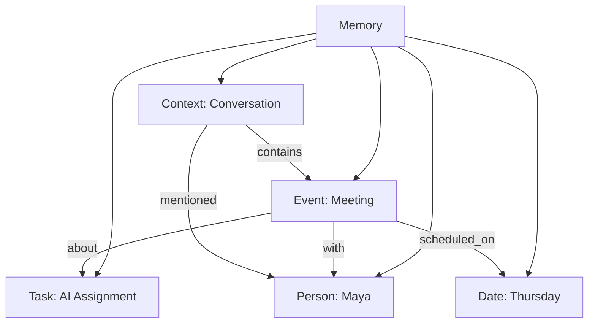
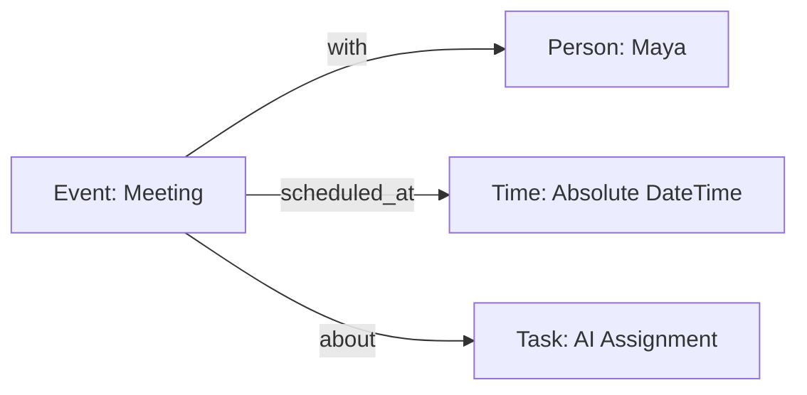
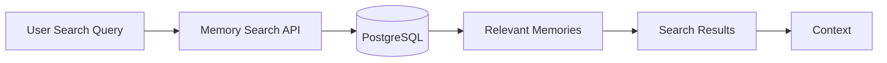
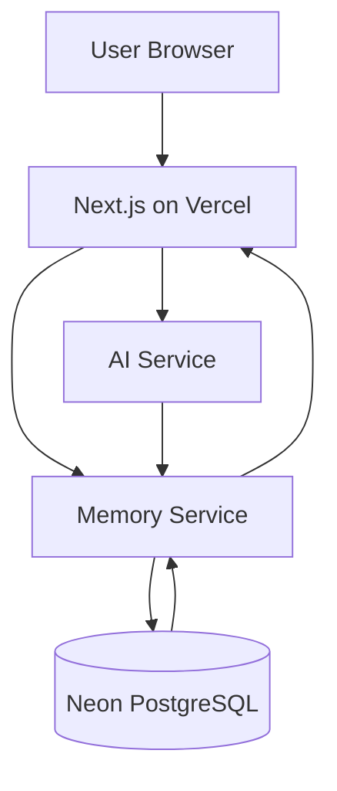
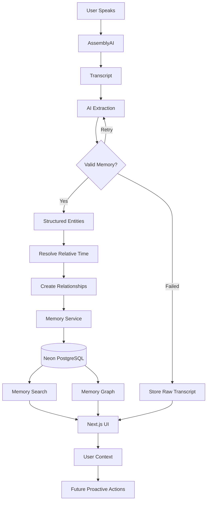

<div align="center">

# EchoMind

### AI-Powered Voice Memory Agent

Turn natural conversations into **structured, connected memories** and retrieve the right context when it matters.

[](https://nextjs.org/)
[](https://react.dev/)
[](https://www.typescriptlang.org/)
[](https://expressjs.com/)
[](https://www.postgresql.org/)
[](https://www.assemblyai.com/)

</div>

---

## Overview

**EchoMind** is a voice-first personal memory agent designed to turn everyday speech into structured, connected memories.

Instead of manually writing notes, users can speak naturally. EchoMind transcribes the conversation, extracts people, tasks, events, facts, and relationships, resolves relative dates, stores the memory, and makes it searchable through a connected memory graph.

### The idea

Traditional memory tools usually require users to decide what is important before saving it.

EchoMind reverses that workflow:

```
Speak naturally
      ↓
EchoMind understands the conversation
      ↓
Important information becomes structured memory
      ↓
Relationships connect the information
      ↓
Memory can be searched, visualized, or forgotten
```

> **Talk naturally. Let EchoMind remember the context.**

---

## Core Features

| Feature | Description |
|---|---|
| **Voice Interaction** | Capture natural speech through AssemblyAI Voice Agent |
| **AI Memory Extraction** | Convert raw transcripts into structured memories |
| **Entity Detection** | Identify people, tasks, events, facts, and relevant context |
| **Relationship Graph** | Connect memories and entities into a visual graph |
| **Relative Time Resolution** | Resolve phrases such as "tomorrow" and "next Friday" |
| **Memory Search** | Search and retrieve previously stored context |
| **Forget Memory** | Remove selected memories when they are no longer wanted |
| **Proactive Context** | Use stored context for future reminders and relevant suggestions |
| **Persistent Storage** | Store structured memories with PostgreSQL and Neon |
| **REST APIs** | Separate services for memory and AI processing |

---

## System Architecture


```mermaid
flowchart TB
    U[User] --> V[Voice Interface]
    V --> A[AssemblyAI Voice Agent]
    A --> T[Live Transcript]
    T --> AI[AI Extraction Service]
    AI --> P[People]
    AI --> TK[Tasks]
    AI --> E[Events]
    AI --> F[Facts]
    AI --> R[Relationships]
    AI --> D[Relative Time Resolution]
    P --> M[Memory Service]
    TK --> M
    E --> M
    F --> M
    R --> M
    D --> M
    M --> DB[(Neon PostgreSQL)]
    DB --> S[Memory Search]
    DB --> G[Memory Graph]
    DB --> FR[Forget / Delete]
    S --> FE[Next.js Frontend]
    G --> FE
    FR --> FE
    FE --> C[Relevant Context]
    C --> PR[Future / Proactive Actions]
```

---

## End-to-End Data Flow


```mermaid
sequenceDiagram
    participant User
    participant Frontend
    participant AssemblyAI
    participant AI as AI Service
    participant Memory as Memory Service
    participant DB as Neon PostgreSQL

    User->>Frontend: Speak naturally
    Frontend->>AssemblyAI: Voice stream
    AssemblyAI-->>Frontend: Transcript
    Frontend->>AI: Send transcript
    AI->>AI: Extract entities
    AI->>AI: Resolve dates and relationships
    AI-->>Frontend: Structured memory
    Frontend->>Memory: Store memory
    Memory->>DB: Persist entities and relationships
    DB-->>Memory: Stored
    Memory-->>Frontend: Updated memory
    Frontend-->>User: Memory / graph updated
```

---

## Memory Architecture

EchoMind does not treat every sentence as an isolated note.

Instead, information can be represented as **entities + relationships + context**.


```mermaid
graph TD
    M[Memory]
    P[Person: Maya]
    E[Event: Meeting]
    T[Task: AI Assignment]
    D[Date: Thursday]
    C[Context: Conversation]

    M --> P
    M --> E
    M --> T
    M --> D
    M --> C

    E -->|with| P
    E -->|about| T
    E -->|scheduled_on| D
    C -->|mentioned| P
    C -->|contains| E
```

---

## Tech Stack

```
Frontend     → Next.js · React · TypeScript · Tailwind CSS
Graph        → react-force-graph-2d
Backend      → Node.js · Express
Database     → PostgreSQL · Neon
Voice        → AssemblyAI
AI           → LLM-based structured memory extraction
APIs         → REST
Deployment   → Vercel · FastAPI Cloud
```

---

## Project Structure

```text
EchoMind/
├── backend/              # Express memory service
├── frontend/             # Next.js frontend
├── src/                  # Voice / AI related source
├── schema.sql            # Database schema
├── .env.example          # Environment configuration
├── AGENTS.md             # Project guidance
└── README.md
```

---

## Requirements

- Node.js 18+
- npm
- PostgreSQL database, Neon recommended
- AssemblyAI API access
- Required AI service configuration
- Environment variables configured for frontend and backend

---

## Quick Start

### 1. Clone

```bash
git clone https://github.com/Eman2123/EchoMind.git
cd EchoMind
```

### 2. Backend

```bash
cd backend
npm install
npm start
```

Configure the required backend environment variables before starting the service.

### 3. Frontend

Open a new terminal:

```bash
cd frontend
npm install
npm run dev
```

Open `http://localhost:3000`.

---

## How It Works

### Step 1 — Voice Capture
The user speaks naturally through the EchoMind interface.

### Step 2 — Speech-to-Text
AssemblyAI converts the voice input into a live transcript.

### Step 3 — AI Understanding
The transcript is passed into the AI extraction layer.

The AI identifies:

- People
- Tasks
- Events
- Facts
- Relationships
- Relevant time expressions

### Step 4 — Validation
The extraction layer validates generated information against the original transcript to reduce unsupported entities.

### Step 5 — Time Resolution
Conversational dates are normalized:

```
"tomorrow"       → Absolute calendar date
"next Friday"    → Absolute calendar date
"today at 11 AM" → Absolute date + time
```

### Step 6 — Persistence
Structured information is sent to the memory service and stored in PostgreSQL.

### Step 7 — Graph Construction
Relationships between entities are represented in the memory graph.

### Step 8 — Retrieval
Users can search memories or explore the graph to recover relevant context.

### Step 9 — Forget
When a memory is removed, the active memory state and graph are updated accordingly.

---

## AI Memory Extraction

EchoMind uses structured extraction rather than simply saving the raw transcript.

### Example Input

```
"I have a meeting with Maya tomorrow at 11 AM about the AI assignment."
```

### Extracted Information

```
Person
└── Maya

Event
└── Meeting

Time
└── Tomorrow at 11 AM

Topic
└── AI Assignment
```

### Relationship Model


```mermaid
graph LR
    Maya[Person: Maya]
    Meeting[Event: Meeting]
    Time[Time: Absolute DateTime]
    Task[Task: AI Assignment]

    Meeting -->|with| Maya
    Meeting -->|scheduled_at| Time
    Meeting -->|about| Task
```

The system preserves **meaning and relationships**, not only the original sentence.

---

## Reliability & Safety Checks

| Check | Purpose |
|---|---|
| **Transcript Validation** | Prevent unsupported entities from becoming memories |
| **Name Validation** | Reject names not supported by the transcript |
| **Date Handling** | Convert relative time into usable absolute dates |
| **Retry Logic** | Retry extraction when the first AI attempt fails |
| **Raw Transcript Fallback** | Preserve the original transcript if structured extraction fails |
| **Graph Consistency** | Keep the graph synchronized with memory changes |

---

## Memory Search


```mermaid
flowchart LR
    Q[User Search Query] --> API[Memory Search API]
    API --> DB[(PostgreSQL)]
    DB --> R[Relevant Memories]
    R --> UI[Search Results]
    UI --> C[Context]
```

---

## Forget Flow

Memory is useful only when users can control it.


```mermaid
flowchart LR
    U[User Selects Memory] --> F[Forget Action]
    F --> API[Forget API]
    API --> DB[(PostgreSQL)]
    DB --> G[Update Graph]
    G --> UI[Updated Memory View]
```

---

## Deployment

The current project is split across three live services:

| Service | Purpose | URL |
|---|---|---|
| **Frontend** | Next.js application | [echo-mind-trfi.vercel.app](https://echo-mind-trfi.vercel.app/) |
| **Memory Service** | Express memory and graph APIs | [echo-mind-blush-seven.vercel.app](https://echo-mind-blush-seven.vercel.app/) |
| **AI Service** | AI extraction service | [echomind.fastapicloud.dev](https://echomind.fastapicloud.dev/) |

### Production Architecture


```mermaid
flowchart TB
    User[User Browser]
    Vercel[Next.js on Vercel]
    AI[AI Service]
    Memory[Memory Service]
    Neon[(Neon PostgreSQL)]

    User --> Vercel
    Vercel --> AI
    Vercel --> Memory
    AI --> Memory
    Memory --> Neon
    Neon --> Memory
    Memory --> Vercel
```

---

## Development Checks

Before pushing frontend changes:

```bash
cd frontend
npm run typecheck
npm run build
```

For backend changes:

```bash
cd backend
npm install
npm start
```

---

## Complete Project Flow


```mermaid
flowchart TD
    A[User Speaks] --> B[AssemblyAI]
    B --> C[Transcript]
    C --> D[AI Extraction]
    D --> E{Valid Memory?}
    E -->|Yes| F[Structured Entities]
    E -->|Retry| D
    E -->|Failed| R[Store Raw Transcript]
    F --> G[Resolve Relative Time]
    G --> H[Create Relationships]
    H --> I[Memory Service]
    I --> J[(Neon PostgreSQL)]
    J --> K[Memory Search]
    J --> L[Memory Graph]
    K --> M[Next.js UI]
    L --> M
    R --> M
    M --> N[User Context]
    N --> O[Future Proactive Actions]
```

---

## Roadmap

- [x] Voice-first interaction
- [x] AI memory extraction
- [x] Structured memory entities
- [x] Relationship-based memory graph
- [x] Memory search
- [x] Relative date/time resolution
- [x] Memory forget flow
- [x] PostgreSQL persistence
- [x] Live deployment
- [ ] More advanced semantic retrieval
- [ ] Richer proactive reminders
- [ ] More granular memory permissions
- [ ] Expanded graph relationship types
- [ ] Personal memory analytics

---

## Project Links

- **Repository:** [Eman2123/EchoMind](https://github.com/Eman2123/EchoMind)
- **Live Frontend:** [echo-mind-trfi.vercel.app](https://echo-mind-trfi.vercel.app/)
- **Memory Service:** [echo-mind-blush-seven.vercel.app](https://echo-mind-blush-seven.vercel.app/)
- **AI Service:** [echomind.fastapicloud.dev](https://echomind.fastapicloud.dev/)

---

## Team

- **Eman Mirza**
- **Aroonzz**
- **Felix**
- **Rabeesa**

---

## License

This project is currently intended for hackathon and project demonstration purposes.

<div align="center">

---

**EchoMind · AI-powered personal memory**

</div>
