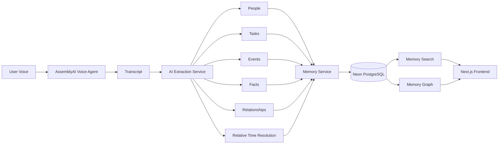

<div align="center">

# EchoMind

### AI-Powered Voice Memory Agent

Turn natural conversations into **structured, connected memories** and retrieve the right context when it matters.

[](https://nextjs.org/)
[](https://react.dev/)
[](https://www.typescriptlang.org/)
[](https://expressjs.com/)
[](https://www.postgresql.org/)
[](https://www.assemblyai.com/)

</div>

---

## Overview

**EchoMind** is a voice-first personal memory agent designed to turn everyday speech into structured, connected memories.

Instead of manually writing notes, users can speak naturally. EchoMind transcribes the conversation, extracts people, tasks, events, facts, and relationships, resolves relative dates, stores the memory, and makes it searchable through a connected memory graph.

The goal is simple:

> **Talk naturally. Let EchoMind remember the context.**

## Core Features

| Feature | Description |
|---|---|
| **Voice Interaction** | Capture natural speech through AssemblyAI Voice Agent |
| **AI Memory Extraction** | Convert raw transcripts into structured memories |
| **Entity Detection** | Identify people, tasks, events, facts, and relevant context |
| **Relationship Graph** | Connect memories and entities into a visual graph |
| **Relative Time Resolution** | Resolve phrases such as "tomorrow" and "next Friday" |
| **Memory Search** | Search and retrieve previously stored context |
| **Forget Memory** | Remove selected memories when they are no longer wanted |
| **Proactive Context** | Use stored context for future reminders and relevant suggestions |
| **Persistent Storage** | Store structured memories with PostgreSQL and Neon |
| **REST APIs** | Separate services for memory and AI processing |

## Tech Stack

```text
Frontend     → Next.js · React · TypeScript · Tailwind CSS
Graph        → react-force-graph-2d
Backend      → Node.js · Express
Database     → PostgreSQL · Neon
Voice        → AssemblyAI
AI           → LLM-based structured memory extraction
APIs         → REST
Deployment   → Vercel · FastAPI Cloud
```

## Architecture


```mermaid
flowchart LR
    U[User Voice] --> V[AssemblyAI Voice Agent]
    V --> T[Transcript]
    T --> AI[AI Extraction Service]
    AI --> P[People]
    AI --> TK[Tasks]
    AI --> E[Events]
    AI --> F[Facts]
    AI --> R[Relationships]
    AI --> D[Relative Time Resolution]
    P --> M[Memory Service]
    TK --> M
    E --> M
    F --> M
    R --> M
    D --> M
    M --> DB[(Neon PostgreSQL)]
    DB --> S[Memory Search]
    DB --> G[Memory Graph]
    S --> FE[Next.js Frontend]
    G --> FE
```

## Project Structure

```text
EchoMind/
├── backend/              # Express memory service
├── frontend/             # Next.js frontend
├── src/                  # Voice / AI related source
├── schema.sql            # Database schema
├── .env.example          # Environment configuration example
├── AGENTS.md             # Project guidance
└── README.md
```

## Requirements

- Node.js 18+
- npm
- PostgreSQL database (Neon recommended)
- AssemblyAI API access
- Required AI service configuration
- Environment variables configured for the frontend and backend

## Quick Start

### 1. Clone

```bash
git clone https://github.com/Eman2123/EchoMind.git
cd EchoMind
```

### 2. Backend

```bash
cd backend
npm install
npm start
```

Configure the required backend environment variables before starting the service.

### 3. Frontend

Open a new terminal:

```bash
cd frontend
npm install
npm run dev
```

Open:

```text
http://localhost:3000
```

For local voice functionality, configure the required variables using the provided frontend environment example.

## How It Works

```text
Voice Input
     │
     ▼
AssemblyAI Voice Agent
     │
     ▼
Live Transcript
     │
     ▼
AI Memory Extraction
     │
     ├── People
     ├── Tasks
     ├── Events
     ├── Facts
     └── Relationships
     │
     ▼
Relative Time Resolution
     │
     ▼
Memory Service
     │
     ▼
Neon PostgreSQL
     │
     ├── Memory Search
     └── Memory Graph
     │
     ▼
Next.js Frontend
```

1. The user speaks naturally through the voice interface.
2. AssemblyAI converts the speech into a live transcript.
3. The AI extraction layer converts the transcript into structured memory.
4. Relevant people, tasks, events, facts, and relationships are identified.
5. Relative time expressions are resolved into usable dates and times.
6. Structured memory is stored in PostgreSQL through the memory service.
7. Users can search memories, inspect the graph, and forget selected memories.
8. Stored context can later support proactive reminders and relevant suggestions.

## AI Memory Extraction

EchoMind uses a structured extraction flow to turn conversational language into useful memory.

For example:

```text
"I have a meeting with Maya tomorrow at 11 AM about the AI assignment."
```

The system can extract:

```text
Person  → Maya
Event   → Meeting
Time    → Tomorrow at 11 AM
Topic   → AI Assignment
```

It can then represent the context as connected information:

```text
Maya
 │
 └── Meeting
       │
       ├── Time → Absolute Date/Time
       └── Topic → AI Assignment
```

The extraction pipeline also includes validation so names that are not supported by the transcript can be discarded, reducing unsupported graph entities.

## Relative Time Resolution

Natural conversations frequently use relative time:

- "tomorrow"
- "next Friday"
- "today at 11 AM"
- "in two days"

EchoMind resolves these expressions into absolute datetimes where possible so that extracted events and tasks can be used later for proactive context.

## Memory Management

EchoMind is designed around persistent context while keeping memory under user control.

Users can:

- View remembered information
- Search stored memories
- Explore connected memory relationships
- Select individual memories
- Forget selected memories

The forget flow also updates the memory graph so removed information does not remain as an active memory node.

## Deployment

The current project is split across three live services:

| Service | Purpose | URL |
|---|---|---|
| **Frontend** | Next.js application | [echo-mind-trfi.vercel.app](https://echo-mind-trfi.vercel.app/) |
| **Memory Service** | Express memory and graph APIs | [echo-mind-blush-seven.vercel.app](https://echo-mind-blush-seven.vercel.app/) |
| **AI Service** | AI extraction service | [echomind.fastapicloud.dev](https://echomind.fastapicloud.dev/) |

## Development Checks

Before pushing frontend changes:

```bash
cd frontend
npm run typecheck
npm run build
```

For backend changes:

```bash
cd backend
npm install
npm start
```

## Project Flow

```text
User Speech
     │
     ▼
Transcript
     │
     ▼
AI Understanding
     │
     ▼
Structured Memory
     │
     ▼
Relationships
     │
     ▼
PostgreSQL
     │
     ├───────────────┐
     ▼               ▼
Search            Graph
     │               │
     └───────┬───────┘
             ▼
       Relevant Context
```

## Roadmap

- [x] Voice-first interaction
- [x] AI memory extraction
- [x] Structured memory entities
- [x] Relationship-based memory graph
- [x] Memory search
- [x] Relative date/time resolution
- [x] Memory forget flow
- [x] PostgreSQL persistence
- [x] Live deployment
- [ ] More advanced semantic retrieval
- [ ] Richer proactive reminders
- [ ] More granular memory permissions
- [ ] Expanded graph relationship types
- [ ] Personal memory analytics

## Project Links

- **Repository:** [Eman2123/EchoMind](https://github.com/Eman2123/EchoMind)
- **Live Frontend:** [echo-mind-trfi.vercel.app](https://echo-mind-trfi.vercel.app/)
- **Memory Service:** [echo-mind-blush-seven.vercel.app](https://echo-mind-blush-seven.vercel.app/)
- **AI Service:** [echomind.fastapicloud.dev](https://echomind.fastapicloud.dev/)

## Team

- **Eman Mirza**
- **Aroonzz**
- **Felix**
- **Rabeesa**

## License

This project is currently intended for hackathon and project demonstration purposes.

<div align="center">

---

**EchoMind · AI-powered personal memory**

</div>
